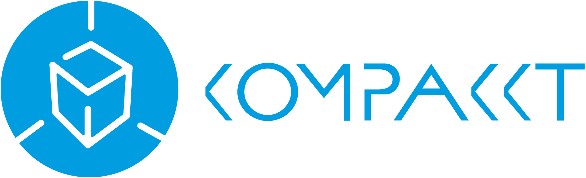

# Kompakkt.Viewer

Web Based 3D Viewer and 3D Annotation System.

## Development setup

Run `npm i` after cloning this repository in order to install needed libraries.

## Development server

Run `ng serve` for a dev server. Navigate to `http://localhost:4200/`. The app will automatically reload if you change any of the source files.

## Build

Run `ng build` to build the project. The build artifacts will be stored in the `dist/` directory. Use the `-prod` flag for a production build.

